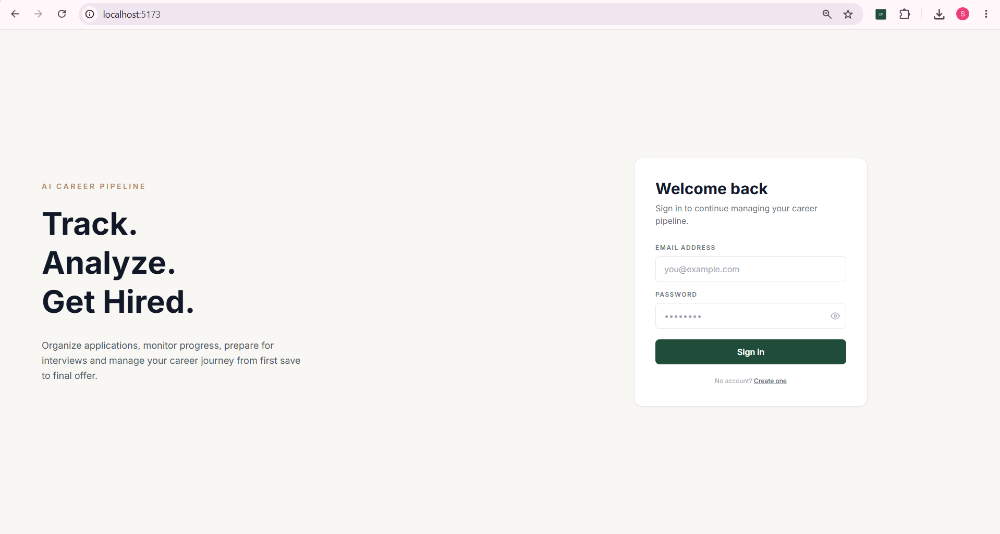
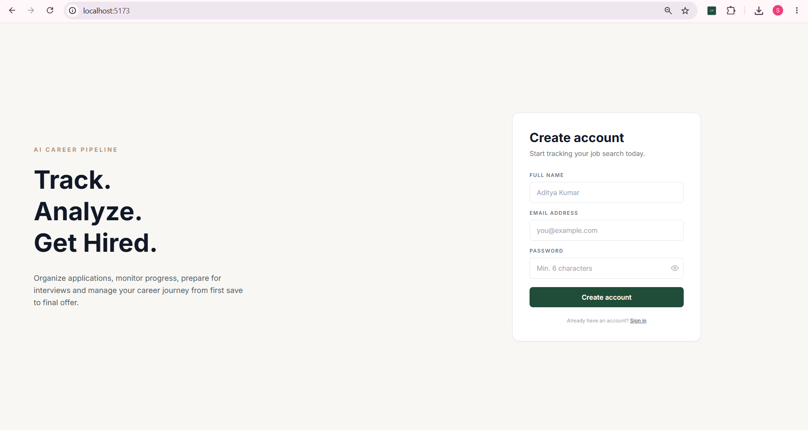
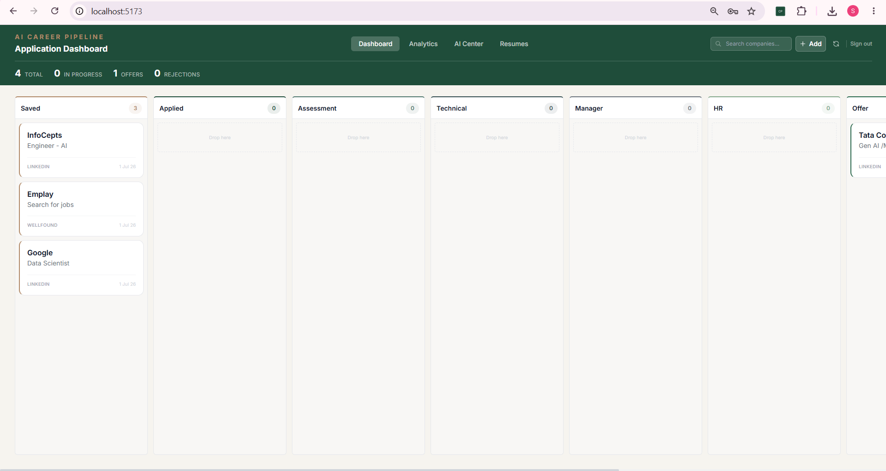
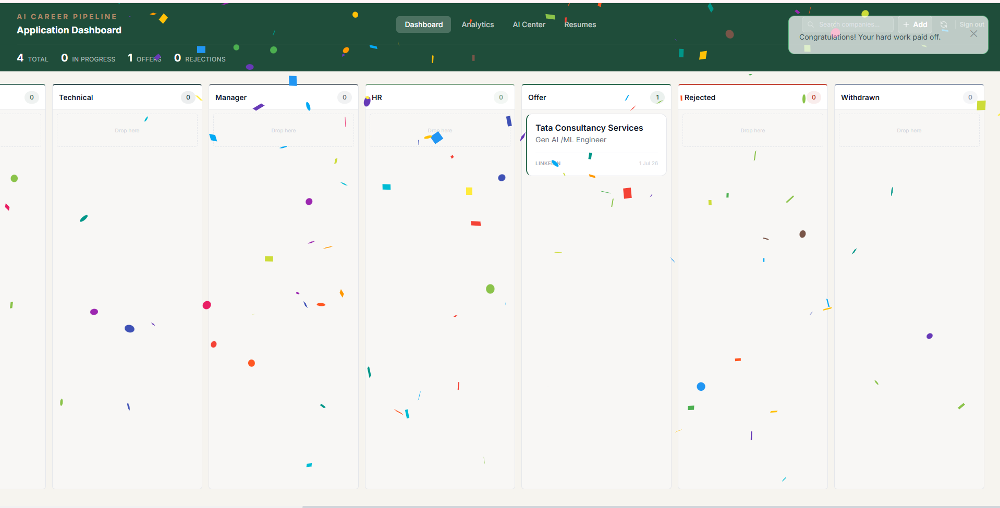
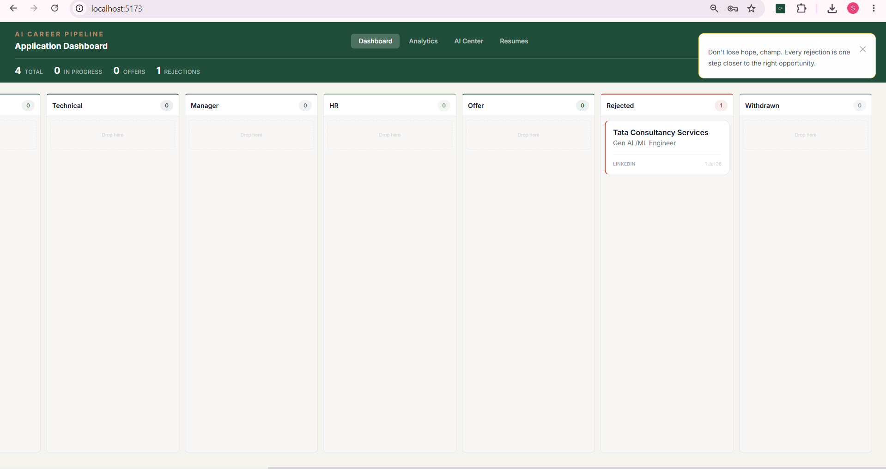
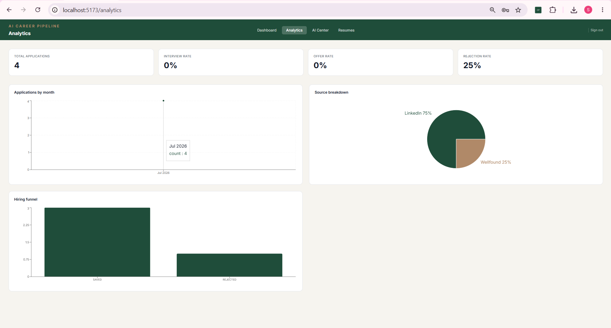
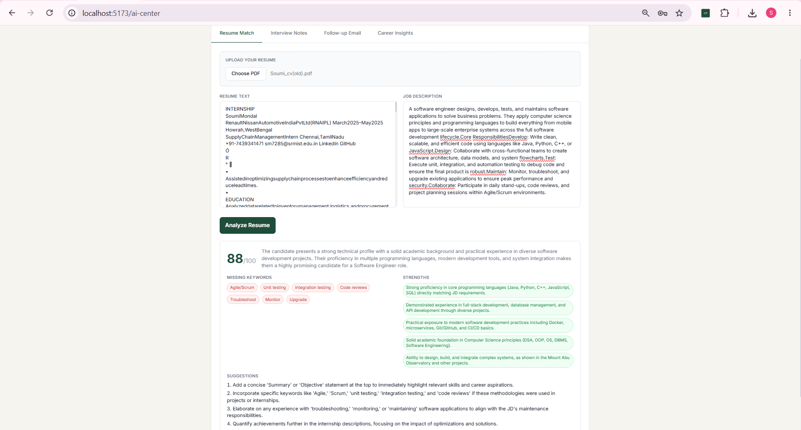
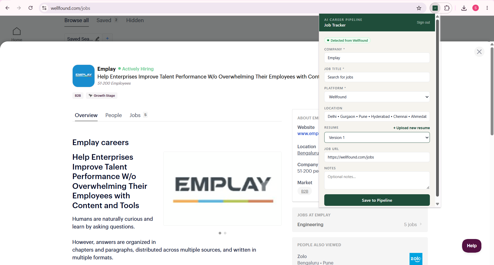
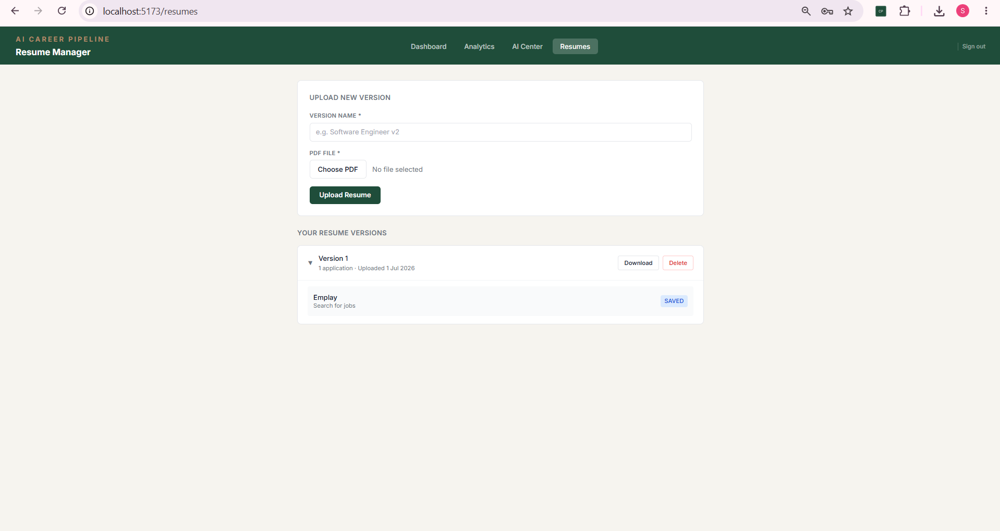

# AI Career Pipeline

A full-stack, microservices-based job application tracker with AI-powered career insights, a browser extension for one-click job capture, and a Kanban-style pipeline board built to mirror how a real production system is architected, not a monolithic one.

> Track every application from "saved" to "offer," get AI feedback on your resume against a job description, auto-draft follow-up emails, and see analytics on where your pipeline is actually leaking.

<!-- 📸 Add screenshots/GIFs here once deployed — see "Screenshots" section below -->

---

## Why this project

Most portfolio projects are a single Express app with a database bolted on. This one is deliberately built as **six independently deployable services communicating over HTTP and Redis pub/sub**, because that's what real backend systems look like — and because I wanted to practice the actual hard parts: service boundaries, event-driven data sync, API gateway routing, and containerized multi-service orchestration.

---

## Architecture

```
                          ┌─────────────────┐
                          │   Frontend       │
                          │  (React + Vite)  │  :5173
                          └────────┬─────────┘
                                   │
                          ┌────────▼─────────┐
                          │   API Gateway     │  :8000
                          │ (auth + routing +  │
                          │  rate limiting)    │
                          └────────┬─────────┘
              ┌────────────────────┼────────────────────┬─────────────────┐
              ▼                    ▼                     ▼                 ▼
     ┌────────────────┐  ┌──────────────────┐  ┌──────────────────┐  ┌───────────┐
     │  Auth Service    │  │ Application       │  │ Analytics         │  │ AI Service │
     │  :8001           │  │ Service :8002     │  │ Service :8003     │  │ :8004      │
     │                  │  │                   │  │                   │  │            │
     │ JWT issuing +    │  │ Applications,      │  │ Pipeline metrics,  │  │ Gemini-    │
     │ validation       │  │ Interviews,        │  │ conversion rates,  │  │ powered    │
     │                  │  │ Resume uploads      │  │ funnel analysis     │  │ insights   │
     └────────┬─────────┘  └────────┬──────────┘  └─────────▲─────────┘  └───────────┘
              │                     │                        │
              ▼                     ▼                        │ (Redis pub/sub event)
     ┌────────────────┐  ┌──────────────────┐                │
     │  auth_db         │  │ application_db     │───────────────┘
     │  (PostgreSQL)     │  │ (PostgreSQL)        │
     └─────────────────┘  └────────┬──────────┘
                                    │
                          ┌─────────▼──────────┐
                          │  MinIO (S3-compat)   │
                          │  Resume file storage  │
                          └───────────────────────┘

                    ┌──────────────────────────┐
                    │  Chrome Extension          │
                    │  Scrapes job postings from  │
                    │  LinkedIn / Indeed / etc.    │
                    │  → saves directly to pipeline │
                    └──────────────────────────┘
```

**Event-driven analytics:** rather than the Analytics Service polling the Application Service, `application-service` publishes an event to Redis on every create/update/delete. `analytics-service` subscribes, recomputes the affected user's metrics, and caches the result — so the analytics dashboard is fast without either service being tightly coupled to the other's database.

---

## Services

| Service | Port | Responsibility | Key tech |
|---|---|---|---|
| **frontend** | 5173 | React SPA — Kanban board, resume manager, AI center, analytics dashboard | React 18, Vite, Tailwind CSS, Recharts, `@hello-pangea/dnd` |
| **api-gateway** | 8000 | Single entry point — JWT verification, request routing, rate limiting | Express, `http-proxy-middleware`, `express-rate-limit` |
| **auth-service** | 8001 | Registration, login, JWT issuing/verification | Express, Prisma, bcryptjs, jsonwebtoken |
| **application-service** | 8002 | CRUD for applications, interviews, and resumes; resume file storage | Express, Prisma, MinIO (via AWS S3 SDK), Multer, `pdfreader`, ioredis |
| **analytics-service** | 8003 | Computes pipeline funnel metrics, conversion rates, source-platform performance | Express, Prisma, ioredis (pub/sub subscriber + cache) |
| **ai-service** | 8004 | Resume ↔ job-description matching, career insight generation, AI-drafted follow-up emails, interview-notes analysis | Express, Google Gemini API |
| **extension** | — | Manifest V3 Chrome extension — detects job postings on LinkedIn, Wellfound, Indeed, Instahyre and saves them to the pipeline in one click | Vanilla JS, `chrome.scripting` |

**Infrastructure:** PostgreSQL (one database per service — `auth_db`, `application_db`, `analytics_db`), Redis (caching + pub/sub event bus), MinIO (S3-compatible object storage for resume PDFs), all orchestrated with Docker Compose.

---

## Features

### Application tracking
- Kanban-style pipeline board with drag-and-drop across 9 stages (Saved → Applied → Online Assessment → Technical Interview → Manager Round → HR Round → Offer / Rejected / Withdrawn)
- Full CRUD on applications, with per-application interview scheduling and notes
- Resume version management — upload multiple resume PDFs, link a specific version to each application, and see which resume led to which interviews

### AI-powered insights (Google Gemini)
- **Resume ↔ job match scoring** — paste a job description, get a match score, missing keywords, and improvement suggestions
- **Career insights** — analyzes your entire application history to surface patterns (which platforms convert best, where you're losing candidates in the funnel, overall pipeline health)
- **AI-drafted follow-up emails** — generates a follow-up email with appropriate tone based on days since last contact
- **Interview notes analyzer** — summarizes interview notes into topics covered, weak areas, and revision suggestions

### Analytics dashboard
- Real-time funnel visualization (application → interview → offer conversion rates)
- Breakdown by source platform (LinkedIn vs. Indeed vs. referral, etc.)
- Event-driven recomputation via Redis pub/sub — stats update the moment an application's stage changes, no manual refresh/polling needed

### Browser extension
- Detects job postings on LinkedIn, Wellfound, Indeed, and Instahyre via DOM scraping (injected at popup-open time to avoid SPA timing issues)
- Auto-fills company, title, location, and platform
- Attach an existing resume or upload a new one, right from the popup
- View and delete your 5 most recent saved applications without leaving the extension

### Security & platform hygiene
- JWT-based auth, verified centrally at the API gateway
- Per-service PostgreSQL databases (no shared-database anti-pattern)
- Rate limiting at the gateway layer
- Multi-stage Docker builds for smaller production images

---

## Tech stack

**Frontend:** React 18, Vite, Tailwind CSS, React Router, Recharts, `@hello-pangea/dnd`, Axios
**Backend:** Node.js, Express, Prisma ORM
**Data layer:** PostgreSQL (3 isolated databases), Redis (cache + pub/sub), MinIO (S3-compatible object storage)
**AI:** Google Gemini API
**Auth:** JWT, bcryptjs
**Infra:** Docker, Docker Compose, multi-stage builds
**Browser extension:** Manifest V3, Chrome Scripting API

---

## Getting started locally

### Prerequisites
- Docker Desktop
- A [Google Gemini API key](https://ai.google.dev/) (free tier available)

### Setup

```bash
git clone https://github.com/<your-username>/ai-career-pipeline.git
cd ai-career-pipeline

cp .env.example .env
# Edit .env — set database passwords, JWT_SECRET, and your GEMINI_API_KEY

docker compose build --no-cache
docker compose up -d

# Run migrations for the three services with their own databases
docker exec ai-career-auth-service npx prisma migrate deploy
docker exec ai-career-application-service npx prisma migrate deploy
docker exec ai-career-analytics-service npx prisma migrate deploy
```

Visit **http://localhost:5173**.

### Loading the browser extension
1. Go to `chrome://extensions`
2. Enable Developer Mode
3. **Load unpacked** → select the `extension/` folder
4. Open a job posting on LinkedIn/Indeed/Wellfound/Instahyre and click the extension icon

---

## API overview

All routes are proxied through the API gateway at `:8000`.

| Method | Endpoint | Description |
|---|---|---|
| `POST` | `/api/auth/register` | Create account |
| `POST` | `/api/auth/login` | Authenticate, receive JWT |
| `GET` | `/api/auth/me` | Get current user |
| `GET` / `POST` | `/api/applications` | List / create applications |
| `GET` / `PUT` / `DELETE` | `/api/applications/:id` | Fetch / update / delete an application |
| `GET` / `POST` | `/api/interviews` | List / schedule interviews |
| `PUT` / `DELETE` | `/api/interviews/:id` | Update / delete an interview |
| `GET` / `POST` | `/api/resumes` | List / upload resumes |
| `GET` / `DELETE` | `/api/resumes/:id` | Fetch resume detail (with linked applications) / delete |
| `POST` | `/api/resumes/extract-text` | Extract text from an uploaded PDF |
| `GET` | `/api/analytics` | Pipeline funnel metrics, conversion rates |
| `POST` | `/ai/resume-match` | Score resume against a job description |
| `GET` | `/ai/career-insights` | AI-generated pattern analysis across all applications |
| `POST` | `/ai/follow-up` | Generate a follow-up email draft |
| `POST` | `/ai/analyze-notes` | Summarize interview notes |

---

## Screenshots

<!--
Add screenshots here once you have them, e.g.:
### Login Page


### Register Page


### Kanban Pipeline Board


### Offer Selection


### Offer Rejected


### Analytics Dashboard


### Interview Notes
.png)

### AI FOLLOW-UP MAIL
.png)

### AI Resume Match


### Career Insights
.png)            

###Chrome Extension
             

### Resume Dashboard

-->

## License

MIT