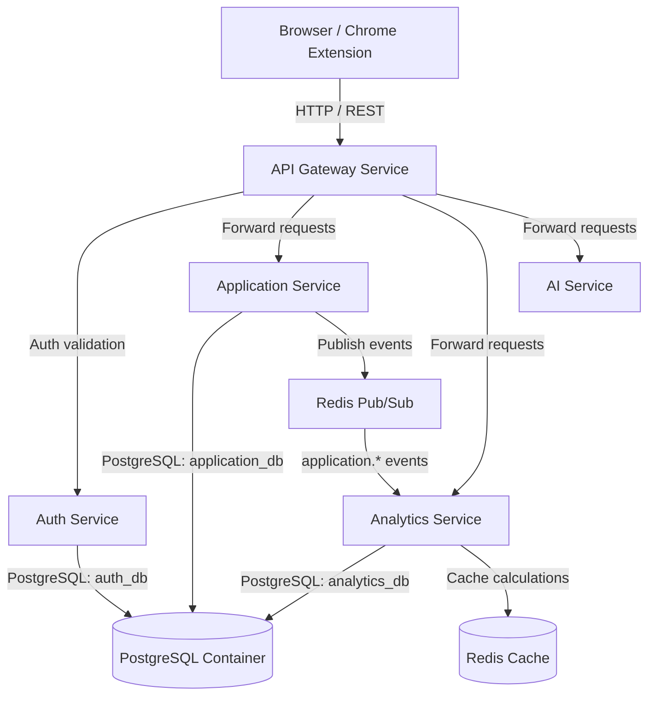

# AI Career Pipeline Manager - Architecture & Folder Structure Design

This document details the architectural specifications, system topology, database design, directory structure, and development plan for the AI Career Pipeline Manager.

---

## 1. System Architecture Design

The system is designed as a Dockerized microservices platform utilizing the **API Gateway Pattern**, **Database-per-Service (Isolation)**, and **Event-Driven Architecture (EDA)**.



### Design Choices & Rationale
1. **API Gateway Pattern (Express.js + Http-Proxy-Middleware)**:
   - **Rationale**: Handles cross-cutting concerns (JWT authentication validation, global rate limiting, request validation) at the perimeter. Downstream services do not need to repeat this logic.
   - **Mechanism**: The Gateway intercepts requests, validates the JWT, injects the decoded user identity into header `x-user-id`, and forwards the request to the target microservice.
2. **Database-per-Service Pattern (Service Isolation)**:
   - **Rationale**: Downstream services are decoupled. `Auth Service` owns `auth_db`, and `Application Service` owns `application_db`. They do not share tables. If the user registration schema changes, it does not affect the Application Service.
   - **Resource Optimization**: To run efficiently on a developer machine, we spin up a single PostgreSQL container but initialize three logically separated databases (`auth_db`, `application_db`, and `analytics_db`).
3. **Event-Driven Analytics (Redis Pub/Sub)**:
   - **Rationale**: Decouples write operations from read-heavy analytics calculations. When an application status changes in the `Application Service`, it publishes an event (`application.status.changed`). The `Analytics Service` consumes this event asynchronously to update metrics.
   - **Performance**: Dashboard loads read cached analytics directly from Redis, ensuring `<10ms` response times.

### Scalability Considerations & Tradeoffs
- **Redis Pub/Sub vs. Kafka/RabbitMQ**: Redis Pub/Sub is a lightweight, fire-and-forget event broker, which is extremely easy to set up and has zero overhead. However, it lacks message persistence and delivery guarantees if the subscriber is offline.
  - *Tradeoff Resolution*: For a 48-hour hackathon project, Redis Pub/Sub provides the best balance of speed and functionality. In a production system, we would migrate to **Redis Streams** or **RabbitMQ** to guarantee message durability and offset tracking.
- **Stateless JWT Authentication**:
  - *Tradeoff*: JWTs cannot be easily revoked before expiration.
  - *Mitigation*: We will use short-lived JWT tokens (e.g., 1 hour). For a production app, we would implement refresh tokens stored in Redis to allow active revocation.

---

## 2. Directory Structure Plan

We will structure the project as a clean, modular multi-service repository:

```
ai-career-pipeline-manager/
├── docker-compose.yml              # Multi-container orchestration
├── .env.example                    # Global environment template
│
├── api-gateway/                    # API Gateway (Port 8000)
│   ├── src/
│   │   ├── middleware/             # Rate limiter, auth validator
│   │   └── index.js                # Gateway runner (Express proxy)
│   ├── package.json
│   └── Dockerfile
│
├── auth-service/                   # Auth Service (Port 8001)
│   ├── prisma/
│   │   └── schema.prisma           # Auth database schema (auth_db)
│   ├── src/
│   │   ├── controllers/            # Register, Login, Profile controllers
│   │   ├── routes/
│   │   └── index.js
│   ├── package.json
│   └── Dockerfile
│
├── application-service/            # Application Service (Port 8002)
│   ├── prisma/
│   │   └── schema.prisma           # Core application database schema (application_db)
│   ├── src/
│   │   ├── controllers/            # CRUD for apps, resumes, interviews
│   │   ├── routes/
│   │   ├── services/               # Redis event publishing service
│   │   └── index.js
│   ├── package.json
│   └── Dockerfile
│
├── analytics-service/              # Analytics Service (Port 8003)
│   ├── prisma/
│   │   └── schema.prisma           # Analytics snapshots schema (analytics_db)
│   ├── src/
│   │   ├── controllers/            # Fetch stats
│   │   ├── routes/
│   │   ├── services/               # Redis event subscriber & calculator
│   │   └── index.js
│   ├── package.json
│   └── Dockerfile
│
├── ai-service/                     # AI Service (Port 8004)
│   ├── src/
│   │   ├── controllers/            # Resume match, interview note analysis, career insights
│   │   ├── services/               # Gemini AI API wrapper
│   │   └── index.js
│   ├── package.json
│   └── Dockerfile
│
├── frontend/                       # Web Dashboard (Port 3000)
│   ├── src/
│   │   ├── components/             # Reusable UI components
│   │   ├── pages/                  # Dashboard, Kanban, Analytics, AI Center
├── docker-compose.yml              # Multi-container orchestration
├── .env.example                    # Global environment template
│
├── api-gateway/                    # API Gateway (Port 8000)
│   ├── src/
│   │   ├── middleware/             # Rate limiter, auth validator
│   │   └── index.js                # Gateway runner (Express proxy)
│   ├── package.json
│   └── Dockerfile
│
├── auth-service/                   # Auth Service (Port 8001)
│   ├── prisma/
│   │   └── schema.prisma           # Auth database schema (auth_db)
│   ├── src/
│   │   ├── controllers/            # Register, Login, Profile controllers
│   │   ├── routes/
│   │   └── index.js
│   ├── package.json
│   └── Dockerfile
│
├── application-service/            # Application Service (Port 8002)
│   ├── prisma/
│   │   └── schema.prisma           # Core application database schema (application_db)
│   ├── src/
│   │   ├── controllers/            # CRUD for apps, resumes, interviews
│   │   ├── routes/
│   │   ├── services/               # Redis event publishing service
│   │   └── index.js
│   ├── package.json
│   └── Dockerfile
│
├── analytics-service/              # Analytics Service (Port 8003)
│   ├── prisma/
│   │   └── schema.prisma           # Analytics snapshots schema (analytics_db)
│   ├── src/
│   │   ├── controllers/            # Fetch stats
│   │   ├── routes/
│   │   ├── services/               # Redis event subscriber & calculator
│   │   └── index.js
│   ├── package.json
│   └── Dockerfile
│
├── ai-service/                     # AI Service (Port 8004)
│   ├── src/
│   │   ├── controllers/            # Resume match, interview note analysis, career insights
│   │   ├── services/               # Gemini AI API wrapper
│   │   └── index.js
│   ├── package.json
│   └── Dockerfile
│
├── frontend/                       # Web Dashboard (Port 3000)
│   ├── src/
│   │   ├── components/             # Reusable UI components
│   │   ├── pages/                  # Dashboard, Kanban, Analytics, AI Center
│   │   ├── styles/                 # Custom Vanilla CSS styling
│   │   ├── App.jsx
│   │   └── main.jsx
│   ├── package.json
│   └── vite.config.js
│
├── extension/                      # Chrome Extension
│   ├── manifest.json
│   ├── background.js
│   ├── popup.html
│   └── popup.js
```

## 3. Database Schema Specifications

### A. Auth Service Database (`auth_db`)
```prisma
datasource db {
  provider = "postgresql"
  url      = env("AUTH_DATABASE_URL")
}

generator client {
  provider = "prisma-client-js"
}

model User {
  id        String   @id @default(uuid())
  email     String   @unique
  password  String   // Hashed bcrypt password
  name      String
  createdAt DateTime @default(now())
  updatedAt DateTime @updatedAt

  @@index([email])
}
```

### B. Application Service Database (`application_db`)
```prisma
datasource db {
  provider = "postgresql"
  url      = env("APPLICATION_DATABASE_URL")
}

generator client {
  provider = "prisma-client-js"
}

enum ApplicationStage {
  SAVED
  APPLIED
  ONLINE_ASSESSMENT
  TECHNICAL_INTERVIEW
  MANAGER_ROUND
  HR_ROUND
  OFFER
  REJECTED
  WITHDRAWN
}

model Application {
  id              String           @id @default(uuid())
  userId          String           // Reference to User.id (Logical FK, not physical)
  company         String
  jobTitle        String
  location        String?
  jobUrl          String?
  sourcePlatform  String           // LinkedIn, Wellfound, Manual, etc.
  stage           ApplicationStage @default(SAVED)
  salaryRange     String?
  notes           String?
  resumeId        String?          // Logical reference to Resume.id
  resume          Resume?          @relation(fields: [resumeId], references: [id])
  interviews      Interview[]
  createdAt       DateTime         @default(now())
  updatedAt       DateTime         @updatedAt

  @@index([userId])
  @@index([stage])
}

model Resume {
  id           String        @id @default(uuid())
  userId       String        // Logical reference
  versionName  String        // e.g. "Software Engineer v1"
  fileUrl      String        // AWS S3 object URL
  textSnippet  String?       // Extracted resume text for AI match
  applications Application[]
  createdAt    DateTime      @default(now())
}

model Interview {
  id            String      @id @default(uuid())
  applicationId String
  application   Application @relation(fields: [applicationId], references: [id], onDelete: Cascade)
  stageName     String      // Technical Interview, HR Round, etc.
  scheduledAt   DateTime
  notes         String?     // Interview prep and recap notes
  createdAt     DateTime    @default(now())
  updatedAt     DateTime    @updatedAt
}
```

### C. Analytics Service Database (`analytics_db`)
```prisma
datasource db {
  provider = "postgresql"
  url      = env("ANALYTICS_DATABASE_URL")
}

generator client {
  provider = "prisma-client-js"
}

model AnalyticsSnapshot {
  id                  String   @id @default(uuid())
  userId              String   // Logical user reference
  totalApplications   Int
  interviewRate       Float    // percentage
  offerRate           Float    // percentage
  rejectionRate       Float    // percentage
  sourceBreakdown     Json     // e.g. { "LinkedIn": 15, "Wellfound": 5 }
  resumeBreakdown     Json     // e.g. { "Resume_v1": 2, "Resume_v2": 4 }
  monthlyTrends       Json     // e.g. { "June 2026": 20 }
  computedAt          DateTime @default(now())

  @@index([userId])
}
```

---

## 4. API Endpoints

### API Gateway Routes (Proxied to downstream services)
- `POST /api/auth/register` -> Proxy to Auth Service `/auth/register`
- `POST /api/auth/login` -> Proxy to Auth Service `/auth/login`
- `GET /api/auth/me` -> Proxy to Auth Service `/auth/me` (requires token)
- `GET/POST/PUT/DELETE /api/applications/*` -> Proxy to Application Service (requires token)
- `GET/POST/PUT/DELETE /api/resumes/*` -> Proxy to Application Service (requires token)
- `GET/POST/PUT/DELETE /api/interviews/*` -> Proxy to Application Service (requires token)
- `GET /api/analytics` -> Proxy to Analytics Service `/analytics` (requires token)
- `POST /api/ai/resume-match` -> Proxy to AI Service `/ai/resume-match` (requires token)
- `POST /api/ai/analyze-notes` -> Proxy to AI Service `/ai/analyze-notes` (requires token)
- `POST /api/ai/follow-up` -> Proxy to AI Service `/ai/follow-up` (requires token)
- `GET /api/ai/career-insights` -> Proxy to AI Service `/ai/career-insights` (requires token)

---

## 5. Event Dictionary (Redis Pub/Sub)

When mutations occur in the `Application Service`, events are published on the channel `application_events` containing a JSON payload:

| Event Type | Source | Payload Details |
|---|---|---|
| `application.created` | Application Service | `{ userId: string, applicationId: string, sourcePlatform: string }` |
| `application.updated` | Application Service | `{ userId: string, applicationId: string, fieldsChanged: string[] }` |
| `application.status.changed` | Application Service | `{ userId: string, applicationId: string, oldStage: string, newStage: string }` |

The `Analytics Service` subscribes to `application_events`, invalidates existing Redis caches for the affected user, and recalculates the statistics.

---

## 6. Docker Container Orchestration

We will define a `docker-compose.yml` spinning up:
1. `postgres` (with an initialization script creating `auth_db`, `application_db`, `analytics_db`)
2. `redis` (for caching and Pub/Sub)
3. `api-gateway`
4. `auth-service`
5. `application-service`
6. `analytics-service`
7. `ai-service`
8. `frontend` (Vite dev server or production preview)

---

## User Review Required

> [!IMPORTANT]
> **Database Architecture & Setup**: We will initialize a single PostgreSQL instance container but configure it via an entrypoint script to host three independent databases (`auth_db`, `application_db`, `analytics_db`). This maintains strict microservice decoupling at the schema/DB level while preventing performance bottlenecks on your local machine.

> [!WARNING]
> **API Key Configuration**: The AI Service will require a Gemini API Key. We will configure it to read `GEMINI_API_KEY` from the environment. You will need to supply this in your local `.env` file before booting the AI service.

---

## Selected Architectural Decisions

1. **AI Model**: `gemini-1.5-flash` via `@google/generative-ai` SDK.
2. **Authentication Flow for Extension**: Chrome Extension popup login form storing JWT in `chrome.storage.local` to call API Gateway services with an `Authorization: Bearer <token>` header.
3. **Resume File Storage**: AWS S3. Resumes will be uploaded directly to S3 via S3 client wrapper library `@aws-sdk/client-s3` in the Application Service, storing the direct URL in `application_db`.
es the JWT in `chrome.storage.local`, or should it use an auth token/cookie sync from the browser? (The popup login form is simpler to build and extremely robust).
> 3. **Resume File Storage**: Since this is a dockerized container environment, where should uploaded resumes be saved? We can store them locally inside a shared Docker volume (e.g., `./uploads`) mapped to the `Application Service` container, which is simple, self-contained, and works offline. Let us know if you prefer this or a cloud solution like AWS S3.

---

# Auth Service Implementation Plan

This section details the design, configuration, and source files of the `auth-service` module.

## User Review Required

> [!IMPORTANT]
> **Database Password Sync**: We noticed your `docker-compose.yml` uses password `myproject123` for PostgreSQL, but `.env` has `postgres_password` in the connection strings (`AUTH_DATABASE_URL`, `APPLICATION_DATABASE_URL`, `ANALYTICS_DATABASE_URL`). We will need to update `.env` connection strings to use `myproject123` to prevent database connection failures.
>
> **Prisma Client Generation inside Docker**: The Dockerfile builds and runs Prisma Client generation before executing. We will ensure Prisma can reach the database on startup by running `prisma db push` or using a startup wait script to verify the PostgreSQL container is ready.

## Proposed Changes

We will create/modify the following files under `auth-service/`:

### 1. [NEW] [package.json](file:///c:/Users/SOUMI%20MONDAL/Desktop/AI%20CAREER%20PIPELINE/auth-service/package.json)
Contains project dependencies: `express`, `@prisma/client`, `bcryptjs`, `jsonwebtoken`, `cors`, `dotenv`, and devDependencies: `prisma`, `nodemon`.

### 2. [NEW] [Dockerfile](file:///c:/Users/SOUMI%20MONDAL/Desktop/AI%20CAREER%20PIPELINE/auth-service/Dockerfile)
Multi-stage build Dockerfile for the Auth microservice.

### 3. [NEW] [schema.prisma](file:///c:/Users/SOUMI%20MONDAL/Desktop/AI%20CAREER%20PIPELINE/auth-service/prisma/schema.prisma)
Configures the connection to `auth_db` and models the `User` schema.

### 4. [NEW] [config.js](file:///c:/Users/SOUMI%20MONDAL/Desktop/AI%20CAREER%20PIPELINE/auth-service/src/config.js)
Loads and validates the service configurations and environment variables (`PORT`, `DATABASE_URL`, `JWT_SECRET`).

### 5. [NEW] [prisma.js](file:///c:/Users/SOUMI%20MONDAL/Desktop/AI%20CAREER%20PIPELINE/auth-service/src/utils/prisma.js)
Provides a singleton instance of the Prisma Client.

### 6. [NEW] [authMiddleware.js](file:///c:/Users/SOUMI%20MONDAL/Desktop/AI%20CAREER%20PIPELINE/auth-service/src/middleware/authMiddleware.js)
Extracts identity either from the Gateway-injected header `x-user-id` or falls back to directly validating a Bearer JWT in the request headers (supporting both Gateway proxying and direct service execution).

### 7. [NEW] [authController.js](file:///c:/Users/SOUMI%20MONDAL/Desktop/AI%20CAREER%20PIPELINE/auth-service/src/controllers/authController.js)
Contains controllers for user registration, user login, and profile fetching. Includes secure password hashing via `bcryptjs` and token generation via `jsonwebtoken`.

### 8. [NEW] [authRoutes.js](file:///c:/Users/SOUMI%20MONDAL/Desktop/AI%20CAREER%20PIPELINE/auth-service/src/routes/authRoutes.js)
Defines routes mapping HTTP verbs/paths to the controllers.

### 9. [NEW] [index.js](file:///c:/Users/SOUMI%20MONDAL/Desktop/AI%20CAREER%20PIPELINE/auth-service/src/index.js)
Initializes the Express server, applies middleware (CORS, JSON parsing), mounts authentication routes, and binds the HTTP listener.

## Verification Plan

### Automated/Local Verification
- Verify Prisma database connection and push schema to `auth_db` using:
  `npx prisma db push`
- Verify that `auth-service` starts locally without database errors.
- Test endpoints `/auth/register`, `/auth/login`, and `/auth/me` using Postman, curl, or standard terminal tests.


# API Gateway Implementation Plan

This section details the design, routing configurations, and authentication middleware of the `api-gateway` module.

## User Review Required

> [!IMPORTANT]
> **Gateway JWT Authentication Logic**: The API Gateway intercepts incoming requests. If the route is protected (e.g. `/api/auth/me`, `/api/applications/*`, `/api/analytics/*`, `/api/ai/*`), the Gateway validates the `Authorization: Bearer <token>` header, decodes it to get the user ID, and injects it into a custom `x-user-id` header passed to downstream services. Downstream services can trust this header because the gateway runs at the perimeter and acts as the single point of entry.
>
> **Local vs. Docker Environment Routing**: To support both local testing (`localhost`) and container orchestration (`docker-compose`), we will configure service URLs to read from environment variables with fallback values.

## Proposed Changes

We will create the following files under `api-gateway/`:

### 1. [NEW] [package.json](file:///c:/Users/SOUMI%20MONDAL/Desktop/AI%20CAREER%20PIPELINE/api-gateway/package.json)
Defines packages: `express`, `http-proxy-middleware`, `jsonwebtoken`, `cors`, `dotenv`, and devDependencies: `nodemon`.

### 2. [NEW] [Dockerfile](file:///c:/Users/SOUMI%20MONDAL/Desktop/AI%20CAREER%20PIPELINE/api-gateway/Dockerfile)
Multi-stage build Dockerfile for the API Gateway service.

### 3. [NEW] [gatewayAuthMiddleware.js](file:///c:/Users/SOUMI%20MONDAL/Desktop/AI%20CAREER%20PIPELINE/api-gateway/src/middleware/gatewayAuthMiddleware.js)
Validates the presence and validity of the Bearer JWT token in the `Authorization` header. Attaches the decoded user ID to `req.user` for downstream injection.

### 4. [NEW] [index.js](file:///c:/Users/SOUMI%20MONDAL/Desktop/AI%20CAREER%20PIPELINE/api-gateway/src/index.js)
Initializes Express, configures proxy routes mapping `/api/auth` to Auth Service, and applies `gatewayAuthMiddleware` on protected routes. Now also maps `/api/applications`, `/api/resumes`, and `/api/interviews` proxy routing to the Application Service.

### 5. [NEW] [test-gateway.js](file:///c:/Users/SOUMI%20MONDAL/Desktop/AI%20CAREER%20PIPELINE/api-gateway/test-gateway.js)
Automated verification script for all proxy routes on port 8000.

## Verification Plan

### Automated/Local Verification
- Verify that `api-gateway` starts locally on port `8000`.
- Verify the following proxy actions:
  - `POST http://localhost:8000/api/auth/register` proxies successfully to `http://localhost:8001/auth/register`.
  - `POST http://localhost:8000/api/auth/login` proxies successfully to `http://localhost:8001/auth/login`.
  - `GET http://localhost:8000/api/auth/me` without a header is rejected by the Gateway with `401 Unauthorized`.
  - `GET http://localhost:8000/api/auth/me` with a valid JWT Bearer token succeeds and returns the profile from `auth-service`.


# Application Service Implementation Plan

This section details the design, configuration, file layout, event structure, and routing for the `application-service` microservice (Port 8002).

## User Review Required

> [!IMPORTANT]
> **Redis Connection fallback**: The service requires a running Redis server (`redis://redis:6379` inside Docker, or `redis://localhost:6379` locally) to publish events for the `Analytics Service` asynchronously.
>
> **File Uploads Volume Mapping**: We will use a local upload strategy with `multer`. Files will be saved in the directory defined by the environment variable `UPLOADS_DIR` (e.g., `./uploads`), which must be accessible under `/uploads` from the browser via proxy routing.

## Proposed Changes

We will create/modify the following files under `application-service/`:

### 1. [NEW] [package.json](file:///c:/Users/SOUMI%20MONDAL/Desktop/AI%20CAREER%20PIPELINE/application-service/package.json)
Dependencies: `express`, `@prisma/client`, `cors`, `dotenv`, `redis`, `multer`, and devDependencies: `prisma`, `nodemon`.

### 2. [NEW] [Dockerfile](file:///c:/Users/SOUMI%20MONDAL/Desktop/AI%20CAREER%20PIPELINE/application-service/Dockerfile)
Multi-stage build Dockerfile for the Application Service microservice.

### 3. [NEW] [schema.prisma](file:///c:/Users/SOUMI%20MONDAL/Desktop/AI%20CAREER%20PIPELINE/application-service/prisma/schema.prisma)
Configures database connection to `application_db` and models `Application`, `Resume`, and `Interview`.

### 4. [NEW] [config.js](file:///c:/Users/SOUMI%20MONDAL/Desktop/AI%20CAREER%20PIPELINE/application-service/src/config.js)
Loads configurations (`PORT`, `DATABASE_URL`, `REDIS_URL`, `UPLOADS_DIR`).

### 5. [NEW] [prisma.js](file:///c:/Users/SOUMI%20MONDAL/Desktop/AI%20CAREER%20PIPELINE/application-service/src/utils/prisma.js)
Database connection singleton using `@prisma/client`.

### 6. [NEW] [redis.js](file:///c:/Users/SOUMI%20MONDAL/Desktop/AI%20CAREER%20PIPELINE/application-service/src/utils/redis.js)
Redis connection client wrapper to publish event payloads onto the Redis channel `application_events`.

### 7. [NEW] [authMiddleware.js](file:///c:/Users/SOUMI%20MONDAL/Desktop/AI%20CAREER%20PIPELINE/application-service/src/middleware/authMiddleware.js)
Extracts `x-user-id` header passed by the API Gateway and attaches it as `req.user.id`.

### 8. [NEW] [applicationController.js](file:///c:/Users/SOUMI%20MONDAL/Desktop/AI%20CAREER%20PIPELINE/application-service/src/controllers/applicationController.js)
CRUD endpoints for job applications. Publishes Redis events (`application.created`, `application.updated`, `application.status.changed`) on change.

### 9. [NEW] [resumeController.js](file:///c:/Users/SOUMI%20MONDAL/Desktop/AI%20CAREER%20PIPELINE/application-service/src/controllers/resumeController.js)
Accepts files via `multer`, saves them to the uploads folder, and creates `Resume` database records.

### 10. [NEW] [interviewController.js](file:///c:/Users/SOUMI%20MONDAL/Desktop/AI%20CAREER%20PIPELINE/application-service/src/controllers/interviewController.js)
CRUD endpoints for tracking interviews scheduled.

### 11. [NEW] [applicationRoutes.js](file:///c:/Users/SOUMI%20MONDAL/Desktop/AI%20CAREER%20PIPELINE/application-service/src/routes/applicationRoutes.js)
Maps endpoints `/` (GET, POST), `/:id` (GET, PUT, DELETE) to the application controller.

### 12. [NEW] [resumeRoutes.js](file:///c:/Users/SOUMI%20MONDAL/Desktop/AI%20CAREER%20PIPELINE/application-service/src/routes/resumeRoutes.js)
Maps endpoints `/` (GET, POST), `/:id` (GET, DELETE) to the resume controller.

### 13. [NEW] [interviewRoutes.js](file:///c:/Users/SOUMI%20MONDAL/Desktop/AI%20CAREER%20PIPELINE/application-service/src/routes/interviewRoutes.js)
Maps endpoints `/` (GET, POST), `/:id` (GET, PUT, DELETE) to the interview controller.

### 14. [NEW] [index.js](file:///c:/Users/SOUMI%20MONDAL/Desktop/AI%20CAREER%20PIPELINE/application-service/src/index.js)
Express server entry point. Serves static files from `uploads` folder and registers routes.

## Verification Plan

### Automated/Local Verification
- Verify database connection and generate client:
  `npx prisma db push`
- Verify service start on Port 8002.
- Configure API Gateway routes to proxy applications, resumes, interviews, and uploads.
- Run verification checks through Gateway Port 8000:
  - Create applications, resumes, and interviews.
  - Assert HTTP responses and data integrity.
  - Verify Redis event publishing on mutations.

